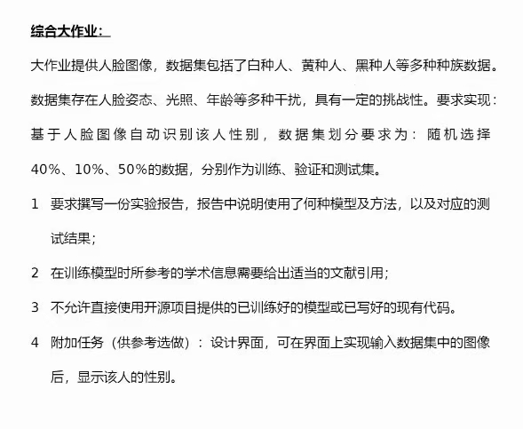

# cpd-2020-summer
THUEE Computer Program Design(2) Project (2020 Summer)

清华大学电子工程系 计算机程序设计基础 小学期（2022夏季学期）

## TODO
- [x] 数据集下载脚本
- [x] 处理数据
- [x] 配环境
- [x] 写demo
- [ ] 搭网络
- [ ] 写训练模块
- [ ] 写评估模块
- [ ] 图形界面
- [ ] 人脸检测+标注性别

## 介绍

### 题目

来源：[知乎：如何评价清华大学电子系大一暑假小学期总共 9 个学时的 Python 课程大作业难度？](https://www.zhihu.com/question/471999381)



### 分析

本质上是一个性别二分类的任务。

### 数据集

- 采用[LFW](http://vis-www.cs.umass.edu/lfw/#download)数据集

- 数据采用"[All images as gzipped tar file](http://vis-www.cs.umass.edu/lfw/lfw.tgz)"

- 标签采用"[Manually verified LFW gender labels, from Mahmoud Afifi, Abdelrahman Abdelhamed.](https://www.dropbox.com/sh/l3ezp9qyy5hid80/AAAjK6HdDScd_1rXASlsmELla?dl=0)"

    - [female_names.txt](https://www.dropbox.com/sh/l3ezp9qyy5hid80/AAA__sZZKZIpic6NeYqUyEc3a/female_names.txt)
    - [male_names.txt](https://www.dropbox.com/sh/l3ezp9qyy5hid80/AAAjK6HdDScd_1rXASlsmELla?dl=0&preview=female_names.txt)


## 环境信息

```
python==3.7
torch==1.8.0
```

## 运行

### 环境

创建一个虚拟环境后

```bash
pip install -r requirements.txt
```

如果提示`pytorch`无法安装，则执行

```bash
pip install torch==1.8.0+cu101 torchvision==0.9.0+cu101 torchaudio==0.8.0  -f https://download.pytorch.org/whl/torch_stable.html
```

后执行前面的命令

### 数据

在根目录下运行

```bash
bash init_data.sh
```

### 运行demo

```bash
python demo.py
```

### 训练（还不支持）

```bash
python train.py
```

### 评估及测试（还不支持）

```bash
python eval.py
```